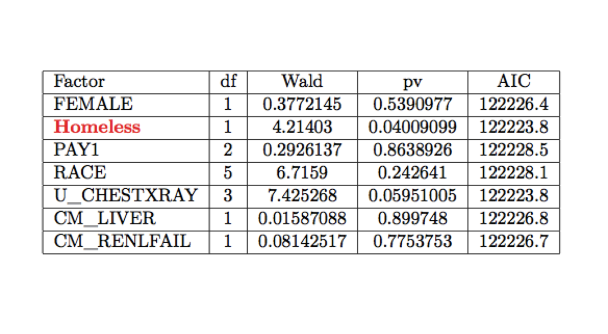

# Introduction
The data set we are using is the 2007 edition of the New York State, Florida State, Vermont State Inpatient Database (SID) from the [Healthcare Cost and Utilization Project](http://www.hcup-us.ahrq.gov/) (HCUP). This data set resulted from a federal-state-industry partnership sponsored by the Agency for Healthcare Research and Quality. These data are collected from community hospitals and contains encounter-level information for all payers (including the uninsured) compiled in a uniform format with privacy protections in place. HCUP is not a survey - it is based on actual hospital discharge records. Some of the limitations include: only contains charges not costs, but costs can be estimated to an approximation; another limitation, it doesn't include patient's laboratory information like blood test results, etc. Here's the full description of the HCUP dataset: (http://www.hcup-us.ahrq.gov/db/state/siddist/sid_multivar.jsp).

The HCUP data set covers charges per inpatient stay and this information allows us to identify variation in practice among hospitals, and determine how this relates to variation in outcomes and cost. Each patient in the data set is assigned a diagnosis-related groups (DRGs), which make up a classification system that group similar clinical conditions (diagnoses) and procedures furnished by the hospital during a patient's stay. The DRG assignment is determined by the patient's principal diagnosis that may include comorbidities or complications, and procedures furnished during the hospital stay.  An example of DRGs include:


<table><tr><th>DRG</th><th>MDC</th><th>TYPE</th><th>MS-DRG Title</th></tr><tr><td>14</td><td>1 </td><td>MED</td><td>INTRACRANIAL HEMORRAHAGE OR CEREBRAL INFARCTION</td></tr><tr><td>88</td><td>4</td><td>MED</td><td>CHRONIC OBSTRUCTIVE PULMONARY DISEASE</td></tr><tr><td>89</td><td>4</td><td>MED</td><td>SIMPLE PNEUMONIA &amp; PLEURISY AGE &gt;17 W CC</td></tr><tr><td>144</td><td>5</td><td>MED</td><td>OTHER CIRCULATORY SYSTEM DIAGNOSES W CC</td></tr><tr><td>174</td><td>6</td><td>MED</td><td>G.I. HEMORRHAGE W CC</td></tr><tr><td>182</td><td>6</td><td>MED</td><td>ESOPHAGITIS,GASTROENT &amp; MISC DIGEST DISORDERS AGE  &gt; 17 W CC</td></tr><tr><td>294</td><td>10</td><td>MED</td><td>DIABETES AGE &gt; 35</td></tr><tr><td>296</td><td>10</td><td>MED</td><td>NUTRITIONAL &amp; MISC METABOLIC DISORDERS AGE &gt; 17 W CC</td></tr><tr><td>316</td><td>11</td><td>MED</td><td>RENAL FAILURE</td></tr><tr><td>320</td><td>11</td><td>MED</td><td>KIDNEY &amp; URINARY TRACT INFECTIONS AGE &gt; 17 W CC</td></tr><tr><td>566</td><td>4</td><td>MED</td><td>RESPIRATORY SYSTEM DXES WITH VENTILATOR SUPPORT &lt; 96 HRS</td></tr><tr><td>575</td><td>18</td><td>MED</td><td>SEPTICEMIA W/ MV96+ HOURS AGE &gt; 17</td></tr><tr><td>576</td><td>18</td><td>MED</td><td>SEPTICEMIA W/O MV96+ HOURS AGE &gt; 17</td></tr><tr><td>871</td><td>18</td><td>MED</td><td>SEPTICEMIA W/O MV96+ hours W/O MCC</td></tr></table>


The DRGs carries a complicating or comorbid condition (CC) or major complicating or comorbid condition (MCC) that determines the Medicare Severity-Diagnosis Related Group (MS-DRG).

Another data set we are using is from the American Hospital Association (AHA), which is a survey-based hospital-level data set. The Database of over 6,400 hospitals includes up to 1,000 fields of information in the following categories:

	1. Organizational Structure
	2. Facility and Service Lines
	3. Inpatient and outpatient utilization
	4. Expenses
	5. Physician arrangements
	6. Staffing
	7. Corporate and purchasing affiliations
	8. Geographic indicators (state, region, CBSA, county)


One can also use the Area Resource File (ARF) for sociodemographic and other 
information on the patient's county of residence (http://ahrf.hrsa.gov/).

An [appendix](#appendix-code) at the end contains all my code, with context.  The code is separately available [here (data processing, R)](final-project.R), [here (graphics, R)](final-project-graphics.R), and [here (data processing, SQL)](final-project.sqlite.script).


## Purpose

There are different kind of illnesses in our data set but most of them are not severe and people after staying in the hospital will be completely cured and the important thing here could be the average day people stay in the hospital. On the other hand for some other illnesses people could die during their stay in the hospital. Below we list these severe illnesses one can do survival analysis on:

	-  Congestive heart failure 
	- Chronic obstructive pulmonary disease (COPD) 
	- Sepsis
	- Cirrhosis
	- Renal failure 

## What will we analyze?
According to our dataset we have different conditions for the people who come to the hospital under the column called ATYPE.
$\textbf{ATYPE}$ stands for admission type. This column is a categorical variable and the uniform coding for admission types are as follows: (1) emergency; (2) urgent; (3) elective; (4) newborn; (5) trauma; (6) other
Other interesting variables we considered are: AGE, AWEEKEND, FEMALE,
Homeless, PAY1, TOTCHG, RACE, CHRON1, U\_CATH, U\_CCU, U\_CHESTXRAY,U\_PACEMAKER, U\_DIALYSIS, U\_EKG, U\_EEG,
CM\_LIVER, CM\_RENALFAIL, CM\_WGTHLOSS, NPR, DRG, and MNAME.
Below are a description of some of these variables:


In our analysis, we focus on patients who have congestive heart failure on their medical history. In congestive heart failure (CHF), the heart cannot pump enough blood through the body. The heart cannot fill with enough blood or pump with enough force, or both. Heart failure develops over time as the pumping action of the heart gets weaker. It can affect the right, the left, or both sides of the heart. Heart failure does not mean that the has stopped working or is about to stop working.

We study the reason for the variation in the length of stay (LOS) for similar patients with similar diagnosis.
We concentrate mostly on the top 10 hospitals (de-identified due to HCUP privacy protections requirements [see here](https://www.hcup-us.ahrq.gov/db/publishing.jsp)) with the most number of CHF patients in New York State as shown below:


There is a report from [HCUP](http://www.hcup-us.ahrq.gov/reports/infographics/HCUP-hospital-readmission-infographic-final.pdf) that shows that nearly one in four patients with congestive heart failure (CHF) were readmitted. The reason why studying for the length of stay among the patients with severe illnesses like CHF  is of interest to the health care community is twofold: 1) The Centers for Medicare and Medicaid Services (CMS) would not reimburse hospitals for patients who get readmitted for the same condition at the same hospital within thirty days of discharge (if patient goes to a different hospital, the first hospital who discharged the patient prematurely will get penalized); 2) CMS has provided benchmarks, the geometric mean length of stay (GMLOS) for hospitals to evaluate their LOS performance. In the geometric mean, multiplication is used to summarize the variables. The geometric mean is appropriate to use for positive continuous variables. The geometric mean is always smaller than the arithmetic mean or average. The geometric mean is always smaller than the arithmetic mean; therefore, if a distribution has a long tail or is positively skewed, the geometric mean is a good measure of the center of the distribution. It is fairly common in the finance industry. CMS uses the geometric mean to summarize lengths of stay according to Medicare severity-adjusted DRG. Lengths of stay are positive variables and tend to have a long tail (a few patients have very long stays).


In the following sections, we test the hypothesis of whether patients with different insurers for the same DRG and same hospital have the same discharge rate or not. We test the hypothesis of whether hospitals around the same neighborhood have the same discharge rate or not for the same DRG. And lastly, we build a cox proportional hazards model. Finally, a conclusion section summarizes the main contributions of the data analysis is conducted.

# Data Visualization 

In this section, we visualize the data we have available to us.
Below we have a plot of the distribution of the mean total costs among all hospitals in New York State for DRG 14 (Intra-cranial hemorrhage or cerebral infarction).
.

Here's the relevant code for the histogram plot
```R
library(plyr)
data_NY_CM_CHF<-ddply(
subset(df_NY_SIDC1,df_NY_SIDC1$DRG %in% DRG_LIST), 
c("MNAME","DRG"), 
summarise, N = length(unique(KEY)), 
MEDIAN=median(TOTCHG,na.rm=T),MEAN = 
mean(TOTCHG,na.rm=T), 
SD=sd(TOTCHG,na.rm=T), 
Q1=quantile(TOTCHG,0.25,type=1,na.rm=T), 
Q3=quantile(TOTCHG,0.75,type=1,na.rm=T))

library(ggplot2)
ggplot(subset(data_NY_CM_CHF,data_NY_CM_CHF$DRG =="94"&data_NY_CM_CHF$MEAN<100000 ), 
aes(x=MEAN)) + 
geom_histogram(aes(fill = ..count..)) + 
geom_vline(aes(xintercept=mean(MEAN, na.rm=T)),   # Ignore NA values for mean
color="red", linetype="dashed", size=1)+ 
xlab("Mean Total Cost ($)") + ylab("Number of Hospitals") +
ggtitle("Distribution of Inpatient, Hospital-level Base Charges in DRG 94") 
```


In the figure below, we have a bubble chart with total charges on the x-axis, length of stay (in days) on the y-axis and the size of the bubble representing the total number of procedures done on a patient. Each bubble represents an individual patient within one unidentified hospital for DRG 14.


Here's the relevant code for the bubble chart:
```R
library(ggplot2)
p1<-ggplot(subset(df_NY_SIDC_CM_CHF,
df_NY_SIDC_CM_CHF$MNAME 
== "Hospital1" 
& df_NY_SIDC_CM_CHF$DRG=="14"), aes(x = TOTCHG, y = LOS1)) +
geom_point(aes(size = NPR), alpha = 0.5, position = "jitter", color = "darkgreen") +
scale_x_continuous(name="Total Charges (in $)")+
scale_y_continuous(name="Length of Stay (in days)")+
ggtitle("Unidentified Hospital for DRG 14")+
scale_size(range = c(3, 15)) +
theme_classic()
```

# Hypothesis Testing 1: Does the rate of patients Discharging from the same hospital among Medicare, Medicaid and Private Insurance Patients Change for DRG 14 at unidentified Hospital?

We performed a Kaplan-Meier method for analysis of time to discharge, in which patients who were admitted to the intensive-care unit or died were censored to show that the time of reporting was cutoff before the only event of interest for the primary analysis (i.e., hospital discharge) occurred.

Here we plot the survival curves for the three insurers: Medicare, Medicaid and Private Insurance for DRG 14 at an unidentified hospital.


Using the log-rank test, our $\chi^{2}$ is 0.2 on 2 degrees of freedom, with p-value being 0.904. Hence it is not significant. 
Because the primary interest is in detecting differences in discharge rates soon after diagnosis, one needs to use a weight function that puts more weight on the early stage. Using the Peto-Peto weight we get a
$\chi^{2} = 1$ on 2 degrees of freedom with a p-value of 0.618. This is still not significant. This suggests there is no difference in the discharge rates of the patients among the different payers.


# Hypothesis Testing 2: Do Hospitals around the same neighborhood have the same discharge rate?
As housing prices are different for different states in the US, we hypothesize that probably hospitals in different states have different discharge rates. However, I only considered a limited number of hospitals in the same state (and same neighborhood--New York City Metropolitan Area). But if we analyze for other states (or even other neighborhoods of the same state, we suspect the discharge rate will be different). 

Below, we show Survival Curves for the three different Hospitals:


We performed the Log-rank test and the Peto-Peto test. For the Log-Rank test, we get a $\chi^{2}$ of 2.6 on 2 degrees of freedom with p-value being 0.278. For the Peto-Peto test, we get a $\chi^{2}$ of 2.6 on 2 degrees of freedom with p-value being 0.267. Thus, there's no significant difference among the three hospitals within the same neighborhood. All three hospitals are teaching hospitals and all highly ranked in NYC.


# Model Building Using the Cox Proportional Hazards Model
For the Cox Proportional Hazards Model, our data set was huge with lots of variables. I selected variables that seem to be the most important like Age, Gender, Race, among others. We built the model using the p-value approach with the Breslow method for handling ties and the Wald test. Below are the different rounds, and the variables highlighted in red are the variables that enter the model.

ROUND 1:


ROUND 2:


ROUND 3:


ROUND 4:


ROUND 5:


ROUND 6:


ROUND 7:


ROUND 8:


ROUND 9:


No more variables can enter the model.

Below gives the summary of the final model:


We evaluated the above model at the following parameters for the four patient groups:


Below is the Cox Proportional Hazards Model Survival Curves for different charges: $10,000, $40,000, $60,000 and $100,000:


The results are as expected. If you incur higher charges, that usually mean you stay in the hospital longer. We also found the 95% confidence intervals for the survival functions for the 4 groups of patient at 8 days.
  -For the $10,000 group, we have [4.3e-14,5.5e-8]
  -For the $40,000 group, we have [0.03,0.15]
  -For the $60,000 group, we have [0.45, 0.64]
  -For the $100,000 group, we have [0.96, 0.98]

Hence we see, it is very likely if you incur $100,000 in hospital charges that you will most likely be at the hospital on Day 8, whereas, if you incur $10,000 it is not that likely that you will stick around in the hospital on Day 8.

In the following figure we compare patients who are admitted on the weekend versus the weekday.
Below is the Survival Curve for Weekend admitted patients versus Weekday admitted patients


This coincides with other published results where the average LOS is the same for weekend and weekday admissions: [Table 1 Patient, hospital, and stay characteristics for weekday and weekend admissions, 2007](https://www.ncbi.nlm.nih.gov/books/NBK53602/table/sb87.t1/?report=objectonly).

One would expect that the patients admitted to the hospital on the weekends would have a longer LOS than those admitted on the weekdays because there's less staff. However, there's also less weekend admissions compared to weekday admissions. Hospitals know how many staff to have on the hospitals which explains why there is less staff on weekends--less number of patients.

# Conclusion and Recommendations
We tested two hypothesis. We concluded that for the same DRG for the same hospital, the discharge rate was the same among all payors. We also concluded that for the same DRG, hospitals within the same vicinity and same type of hospitals (ranked highly, are teaching hospitals) have the same discharge rate. We also computed the confidence intervals of LOS at 8 days for patients of four different groups (group1: patients who incur $10,000 in hospital charges; group2: patients who incur $40,000 in hospital charges; group3: patients who incur $60,000 in hospital charges; and group 4: patients who incur $100,000 in hospital charges). We also determined there's no weekend effect for LOS.

For future work, we can consider hospital structural variables (like the number of beds, number of CT Scanners/Technological Medical Equipment, and the teaching status of the hospital, etc.). It will also be interesting to do a comparative state analysis (New York versus Florida versus Vermont). Also one can use the survival model we built for the LOS to predict total charge.


# Appendix: Code


'R' code for Cox Proportional Hazard Model Building

```R
setwd("/Volumes/USB20FD/Survival Analysis/Filter_Dataset")
# load package
df_NY_SIDC<-read.csv("df_NY_SIDC_CM_CHF.csv",colClasses="character") 
#casting variables to numeric or factors
df_NY_SIDC$"AGE"<-as.numeric(df_NY_SIDC$"AGE")
df_NY_SIDC$"ATYPE"<-as.factor(df_NY_SIDC$"ATYPE")
df_NY_SIDC$"AWEEKEND"<-as.factor(df_NY_SIDC$"AWEEKEND")
df_NY_SIDC$"DIED"<-as.factor(df_NY_SIDC$"DIED")
df_NY_SIDC$"DISPUB04"<-as.factor(df_NY_SIDC$"DISPUB04")
df_NY_SIDC$"DISPUNIFORM"<-as.factor(df_NY_SIDC$"DISPUNIFORM")
df_NY_SIDC$"FEMALE"<-as.factor(df_NY_SIDC$"FEMALE")
df_NY_SIDC$"Homeless"<-as.factor(df_NY_SIDC$"Homeless")
df_NY_SIDC$"PR1"<-as.factor(df_NY_SIDC$"PR1")
df_NY_SIDC$"PR2"<-as.factor(df_NY_SIDC$"PR2")
df_NY_SIDC$"PAY1"<-as.factor(df_NY_SIDC$"PAY1")
df_NY_SIDC$"LOS1"<-as.numeric(df_NY_SIDC$"LOS1")
df_NY_SIDC$"TOTCHG"<-as.numeric(df_NY_SIDC$"TOTCHG")
df_NY_SIDC$"RACE"<-as.factor(df_NY_SIDC$"RACE")
df_NY_SIDC$"ZIPINC_QRTL"<-as.factor(df_NY_SIDC$"ZIPINC_QRTL")
df_NY_SIDC$"CHRON1"<-as.factor(df_NY_SIDC$"CHRON1")
df_NY_SIDC$"CHRON2"<-as.factor(df_NY_SIDC$"CHRON2")
df_NY_SIDC$"U_CATH"<-as.factor(df_NY_SIDC$"U_CATH")
df_NY_SIDC$"U_CCU"<-as.factor(df_NY_SIDC$"U_CCU")
df_NY_SIDC$"U_CHESTXRAY"<-as.factor(df_NY_SIDC$"U_CHESTXRAY")
df_NY_SIDC$"U_ICU"<-as.factor(df_NY_SIDC$"U_ICU")
df_NY_SIDC$"U_PACEMAKER"<-as.factor(df_NY_SIDC$"U_PACEMAKER")
df_NY_SIDC$"U_DIALYSIS"<-as.factor(df_NY_SIDC$"U_DIALYSIS")
df_NY_SIDC$"U_EKG"<-as.factor(df_NY_SIDC$"U_EKG")
df_NY_SIDC$"U_EEG"<-as.factor(df_NY_SIDC$"U_EEG")
df_NY_SIDC$"CM_CHF"<-as.factor(df_NY_SIDC$"CM_CHF")
df_NY_SIDC$"CM_LIVER"<-as.factor(df_NY_SIDC$"CM_LIVER")
df_NY_SIDC$"CM_RENLFAIL"<-as.factor(df_NY_SIDC$"CM_RENLFAIL")
df_NY_SIDC$"CM_WGHTLOSS"<-as.factor(df_NY_SIDC$"CM_WGHTLOSS")
df_NY_SIDC$"NPR"<-as.numeric(df_NY_SIDC$"NPR")
df_NY_SIDC$"DRG"<-as.factor(df_NY_SIDC$"DRG")
df_NY_SIDC$"MNAME"<-as.factor(df_NY_SIDC$"MNAME")
df_NY_SIDC$"DX1"<-as.factor(df_NY_SIDC$"DX1")
df_NY_SIDC$"DX2"<-as.factor(df_NY_SIDC$"DX2")

df_NY_SIDC$delta<-ifelse((df_NY_SIDC$DIED==1|df_NY_SIDC$U_ICU ==1),0,1)

Local.Wald.Test=function(fit,index)
#fit: the cox object
#index: the location of the parameters (want to be tested)
{
	df=length(index)
	Wald=t(fit$coef[index])%*%solve(fit$var[index,index]
	)%*%(fit$coef[index])
	pv=1-pchisq(Wald,df)
	AIC<-AIC(fit)
	res=c(df,Wald,pv,AIC)
	return(res)
}
########
### Don't use variable 6, 7,16
#Round 1    6:9 12 14:21 23:26  28:33 
for(i in c(2:4,8:9,12,14:15,17:21,23:26,28:33))
{
	fit=coxph(Surv(LOS1,delta)~df_NY_SIDC[,i],data=df_NY_SIDC, method="breslow")
	res=Local.Wald.Test(fit,1:(length(fit$coef)))
	#output for latex convenience
	cat(names(df_NY_SIDC)[i],"&",res[1],"&",
	res[2],"&",res[3],"&",res[4], "&", "\n")
}

## DISPUNIFORM,TOTCHG,RACE,CHRON1,U_EKG,U_EEG,CM_WGHTLOSS,
## NPR, DRG, MNAME enters the model
###########################
#Round 2
### Don't use variable 6, 7,16
for(i in c(2:4,8:9,12,15,19:21,23:24,28:29))
{
	fit=coxph(Surv(LOS1,delta)~
	df_NY_SIDC[,"TOTCHG"] + 
	df_NY_SIDC[,"CHRON1"] + df_NY_SIDC[,"U_EKG"] +
	df_NY_SIDC[,"U_EEG"] + df_NY_SIDC[,"CM_WGHTLOSS"] +
	df_NY_SIDC[,"NPR"] + df_NY_SIDC[,"DRG"] +
	df_NY_SIDC[,"MNAME"]+ 
	df_NY_SIDC[,i],data=df_NY_SIDC, method="breslow")
	res=Local.Wald.Test(fit,33:(length(fit$coef)))
	cat(names(df_NY_SIDC)[i], "&", res[1], "&", res[2],"&",res[3],"&",res[4],"&","\n")
}
#1+1+3+3+1+1+13+9
### ROUND 3
for(i in c(3:4,8:9,12,15,19,21,23:24,28:29))
{
	fit=coxph(Surv(LOS1,delta)~
	df_NY_SIDC[,"TOTCHG"] + 
	df_NY_SIDC[,"CHRON1"] + df_NY_SIDC[,"U_EKG"] +
	df_NY_SIDC[,"U_EEG"] + df_NY_SIDC[,"CM_WGHTLOSS"] +
	df_NY_SIDC[,"NPR"] + df_NY_SIDC[,"DRG"] +
	df_NY_SIDC[,"MNAME"]+ df_NY_SIDC[,"AGE"] +
	df_NY_SIDC[,"U_CCU"]+
	df_NY_SIDC[,i],data=df_NY_SIDC, method="breslow")
	res=Local.Wald.Test(fit,35:(length(fit$coef)))
	cat(names(df_NY_SIDC)[i], "&", res[1], "&", res[2],"&",res[3],"&",res[4],"&","\n")
}
#1+1+3+3+1+1+13+9+1+1
### ROUND 3
for(i in c(3:4,8:9,12,15,19,21,24,28:29))
{
	fit=coxph(Surv(LOS1,delta)~
	df_NY_SIDC[,"TOTCHG"] + 
	df_NY_SIDC[,"CHRON1"] + df_NY_SIDC[,"U_EKG"] +
	df_NY_SIDC[,"U_EEG"] + df_NY_SIDC[,"CM_WGHTLOSS"] +
	df_NY_SIDC[,"NPR"] + df_NY_SIDC[,"DRG"] +
	df_NY_SIDC[,"MNAME"]+ df_NY_SIDC[,"AGE"] +
	df_NY_SIDC[,"U_CCU"]+ df_NY_SIDC[,"U_PACEMAKER"]+
	df_NY_SIDC[,i],data=df_NY_SIDC, method="breslow")
	res=Local.Wald.Test(fit,37:(length(fit$coef)))
	cat(names(df_NY_SIDC)[i], "&", res[1], "&", res[2],"&",res[3],"&",res[4],"&","\n")
}
#1+1+3+3+1+1+13+9+1+1+2
### ROUND 4
for(i in c(3:4,8:9,12,15,19,21,28:29))
{
	fit=coxph(Surv(LOS1,delta)~
	df_NY_SIDC[,"TOTCHG"] + 
	df_NY_SIDC[,"CHRON1"] + df_NY_SIDC[,"U_EKG"] +
	df_NY_SIDC[,"U_EEG"] + df_NY_SIDC[,"CM_WGHTLOSS"] +
	df_NY_SIDC[,"NPR"] + df_NY_SIDC[,"DRG"] +
	df_NY_SIDC[,"MNAME"]+ df_NY_SIDC[,"AGE"] +
	df_NY_SIDC[,"U_CCU"]+ df_NY_SIDC[,"U_PACEMAKER"]+
	df_NY_SIDC[,"U_DIALYSIS"]+
	df_NY_SIDC[,i],data=df_NY_SIDC, method="breslow")
	res=Local.Wald.Test(fit,40:(length(fit$coef)))
	cat(names(df_NY_SIDC)[i], "&", res[1], "&", res[2],"&",res[3],"&",res[4],"&","\n")
}
#1+1+3+3+1+1+13+9+1+1+2+3
### ROUND 5
for(i in c(3:4,8:9,12,15,21,28:29))
{
	fit=coxph(Surv(LOS1,delta)~
	df_NY_SIDC[,"TOTCHG"] + 
	df_NY_SIDC[,"CHRON1"] + df_NY_SIDC[,"U_EKG"] +
	df_NY_SIDC[,"U_EEG"] + df_NY_SIDC[,"CM_WGHTLOSS"] +
	df_NY_SIDC[,"NPR"] + df_NY_SIDC[,"DRG"] +
	df_NY_SIDC[,"MNAME"]+ df_NY_SIDC[,"AGE"] +
	df_NY_SIDC[,"U_CCU"]+ df_NY_SIDC[,"U_PACEMAKER"]+
	df_NY_SIDC[,"U_DIALYSIS"]+df_NY_SIDC[,"U_CATH"]+
	df_NY_SIDC[,i],data=df_NY_SIDC, method="breslow")
	res=Local.Wald.Test(fit,43:(length(fit$coef)))
	cat(names(df_NY_SIDC)[i], "&", res[1], "&", res[2],"&",res[3],"&",res[4],"&","\n")
}
#1+1+3+3+1+1+13+9+1+1+2+3+3
### ROUND 6
for(i in c(3,8:9,12,15,21,28:29))
{
	fit=coxph(Surv(LOS1,delta)~
	df_NY_SIDC[,"TOTCHG"] + 
	df_NY_SIDC[,"CHRON1"] + df_NY_SIDC[,"U_EKG"] +
	df_NY_SIDC[,"U_EEG"] + df_NY_SIDC[,"CM_WGHTLOSS"] +
	df_NY_SIDC[,"NPR"] + df_NY_SIDC[,"DRG"] +
	df_NY_SIDC[,"MNAME"]+ df_NY_SIDC[,"AGE"] +
	df_NY_SIDC[,"U_CCU"]+ df_NY_SIDC[,"U_PACEMAKER"]+
	df_NY_SIDC[,"U_DIALYSIS"]+df_NY_SIDC[,"U_CATH"]+
	df_NY_SIDC[,"AWEEKEND"] +
	df_NY_SIDC[,i],data=df_NY_SIDC, method="breslow")
	res=Local.Wald.Test(fit,44:(length(fit$coef)))
	cat(names(df_NY_SIDC)[i], "&", res[1], "&", res[2],"&",res[3],"&",res[4],"&","\n")
}
#1+1+3+3+1+1+13+9+1+1+2+3+3+1
## ROUND 7 
#1+1+3+3+1+1+13+9+1+1+2+3+3+1+3
## ROUND 8 
for(i in c(8,12,15,21,28:29))
{
	fit=coxph(Surv(LOS1,delta)~
	df_NY_SIDC[,"TOTCHG"] + 
	df_NY_SIDC[,"CHRON1"] + df_NY_SIDC[,"U_EKG"] +
	df_NY_SIDC[,"U_EEG"] + df_NY_SIDC[,"CM_WGHTLOSS"] +
	df_NY_SIDC[,"NPR"] + df_NY_SIDC[,"DRG"] +
	df_NY_SIDC[,"MNAME"]+ df_NY_SIDC[,"AGE"] +
	df_NY_SIDC[,"U_CCU"]+ df_NY_SIDC[,"U_PACEMAKER"]+
	df_NY_SIDC[,"U_DIALYSIS"]+df_NY_SIDC[,"U_CATH"]+
	df_NY_SIDC[,"AWEEKEND"] + df_NY_SIDC[,"ATYPE"]+
	df_NY_SIDC[,"Homeless"]+
	df_NY_SIDC[,i],data=df_NY_SIDC, method="breslow")
	res=Local.Wald.Test(fit,48:(length(fit$coef)))
	cat(names(df_NY_SIDC)[i], "&", res[1], "&", res[2],"&",res[3],"&",res[4],"&","\n")
}
#1+1+3+3+1+1+13+9+1+1+2+3+3+1+3+1

fit=coxph(Surv(LOS1,delta)~TOTCHG + factor(CHRON1) + factor(U_EKG) +
factor(U_EEG) + factor(CM_WGHTLOSS)+
NPR + factor(DRG) +
factor(MNAME)+ AGE +
factor(U_CCU)+ factor(U_PACEMAKER)+
factor(U_DIALYSIS)+factor(U_CATH)+
factor(AWEEKEND) + factor(ATYPE)+
factor(Homeless),data=df_NY_SIDC, method="breslow")

CHARGES_BUCKETS<-20000
#NY_CHF_HOPS
newdata=data.frame(
TOTCHG= CHARGES_BUCKETS
,CHRON1=0
,U_EKG=1
,U_EEG=1
,CM_WGHTLOSS=1
,NPR=2
,DRG=89 
,MNAME=c("Hopsital 1")
,AGE=65
,U_CCU=1
,U_PACEMAKER=0
,U_DIALYSIS=0
,U_CATH=0
,AWEEKEND=c(1,0)
,ATYPE=1
,Homeless=0
)

fit.new=survfit(fit,newdata=newdata)
plot(fit.new,col=c(1:2),
lty=1:6, lwd=2, xlim=c(0,8), mark.time = F, xlab='LOS',
ylab='Patients admitted to hospital (%)')
legend(5, .55, c("Weekend","Weekday"), col=c(1:2), lty=1:6, lwd=2, bty="n")

#NY_CHF_HOPS
newdata=data.frame(
TOTCHG= 40000
,CHRON1=0
,U_EKG=1
,U_EEG=1
,CM_WGHTLOSS=1
,NPR=2
,DRG=89 
,MNAME=c("Hospital 1","Hospital 2",
"Hospital 3","Hospital 4",
"Hospital 5",
"Hospital 6")
,AGE=65
,U_CCU=1
,U_PACEMAKER=0
,U_DIALYSIS=c(0,0,0,1,1,1)
,U_CATH=0
,AWEEKEND=0
,ATYPE=1
,Homeless=0
)

fit.new=survfit(fit,newdata=newdata)
plot(fit.new,col=c(1:6),
lty=1:6, lwd=2, xlim=c(0,20), mark.time = F, xlab='LOS',
ylab='Patients admitted to hospital (%)')
legend(12, .6, c("GROUP 1",
"GROUP 2",
"GROUP 3",
"GROUP 4",
"GROUP 5",
"GROUP 6"), col=c(1:6), lty=1:6, lwd=2, bty="n")

newdata=data.frame(
TOTCHG= 40000
,CHRON1=0
,U_EKG=1
,U_EEG=1
,CM_WGHTLOSS=1
,NPR=2
,DRG=89 
,MNAME=c("Hospital 1","Hospital 2",
"Hospital 3","Hospital 4",
"Hospital 5",
"Hospital 6")
,AGE=65
,U_CCU=1
,U_PACEMAKER=0
,U_DIALYSIS=0
,U_CATH=0
,AWEEKEND=0
,ATYPE=1
,Homeless=c(0,0,0,1,1,1)
)

fit.new=survfit(fit,newdata=newdata)
plot(fit.new,col=c(1:6),
lty=1:6, lwd=2, xlim=c(0,20), mark.time = F, xlab='LOS',
ylab='Patients admitted to hospital (%)')
legend(12, .6, c("GROUP 1",
"GROUP 2",
"GROUP 3",
"GROUP 4",
"GROUP 5",
"GROUP 6"), col=c(1:6), lty=1:6, lwd=2, bty="n")

newdata=data.frame(
TOTCHG= c(40000,40000,80000,120000)
,CHRON1=(0,1,1,0)
,U_EKG=1
,U_EEG=1
,CM_WGHTLOSS=1
,NPR=2
,DRG=89 
,MNAME=c("North Shore University Hospital")
,AGE=65
,U_CCU=1
,U_PACEMAKER=0
,U_DIALYSIS=0
,U_CATH=0
,AWEEKEND=c(0,1,1,1)
,ATYPE=(0,1,1,1)
,Homeless=0
)

fit.new=survfit(fit,newdata=newdata)
plot(fit.new,col=c(1:2),
lty=1:6, lwd=2, xlim=c(0,20), mark.time = F, xlab='LOS',
ylab='Patients admitted to hospital (%)')
legend(12, .6, c("GROUP 1",
"GROUP 2"
), col=c(1:2), lty=1:6, lwd=2, bty="n")

newdata=data.frame(
TOTCHG= 40000
,CHRON1=0
,U_EKG=1
,U_EEG=1
,CM_WGHTLOSS=1
,NPR=2
,DRG=89 
,MNAME=c("North Shore University Hospital")
,AGE=65
,U_CCU=1
,U_PACEMAKER=0
,U_DIALYSIS=0
,U_CATH=0
,AWEEKEND=0
,ATYPE=1
,Homeless=1
)

fit.new=survfit(fit,newdata=newdata)
plot(fit.new,col=c(1),
lty=1:6, lwd=2, xlim=c(0,34), mark.time = F,conf.int=F, xlab='LOS',
ylab='Patients admitted to hospital (%)')
legend(20, .7, c("GROUP 1",
"GROUP 2",
"GROUP 3",
"GROUP 4"
), col=c(1:4), lty=1:6, lwd=2, bty="n")
```

